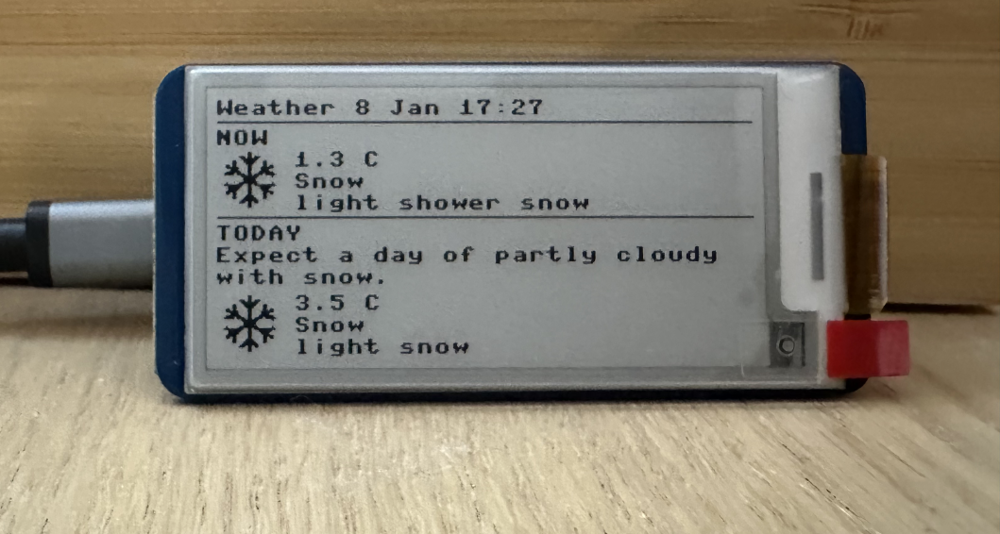

# Pico Weather Dashboard

A simple weather dashboard for the Pi Pico.

Fetches weather data from OpenWeather and displays it on an e-paper display on the Pi Pico.



## Hardware

- [Raspberry Pi Pico W](https://www.raspberrypi.org/products/raspberry-pi-pico/)
- [Waveshare 2.13inch e-Paper HAT](https://www.waveshare.com/wiki/2.13inch_e-Paper_HAT)

## Dependencies

- MicroPython
-  [OpenWeather](https://openweathermap.org/) API key

## Setup

Ensure you have [MicroPython installed](https://micropython.org/download/RPI_PICO_W/) on the Pico W.

1. Clone the repository.
2. Copy `config.txt.example` to `config.txt` and fill in the required values.

## Deploy and run

Copy the Python files in the root directory and the `config.txt` file to the Pico W.

Example using `microupload.py` script:

```bash
$ python3 ./scripts/microupload.py -v /dev/cu.usbmodem14101 config.txt display.py images.py main.py net.py render.py utils.py weather.py
```

Alternatively, you can use the `mpremote` tool to copy the files to the Pi Pico.

```bash
$ mpremote connect /dev/cu.usbmodem14101 cp *.py config.txt :
```

> **Note**
> The `:` at the end of the command is important. It tells `mpremote` to copy the files to the root directory of the Pi Pico.

---

## Running a REPL session

### Prerequisites

Activate the virtual environment:

```bash
source venv/bin/activate
```

Install `mpremote` - MicroPython Remote Control:

```bash
pip install mpremote
```

### Running the REPL

Then to open a REPL session:

```bash
mpremote
```

To exit:
```
Ctrl-]
```

---

## Image attribution

Weather icons by <a target="_blank" href="https://icons8.com">Icons8</a>.

---

## Future improvements

- [ ] Add support for wind speed (m/s)
- [ ] Add support for cloudiness (%)
- [ ] Add support for `alerts`
